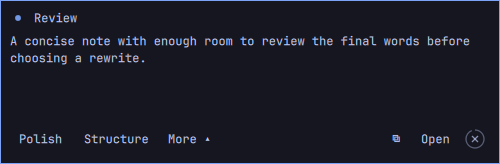

# Mluva for Omarchy

Five lines of live dictation, a preview that follows your theme, and Polish or Structure when you finish. Your original and completed rewrites stay together in [Mluva](https://github.com/1vecera/Mluva).



This community Quickshell plugin is part of Mluva's daily-tested Omarchy workflow and is not an official Omarchy product.

## Install the app and widget together

Use the [Mluva installation command or copyable agent prompt](https://github.com/1vecera/Mluva#install). From a complete source checkout:

```sh
git clone --depth 1 https://github.com/1vecera/Mluva.git mluva
cd mluva
bash install.sh
```

Setup installs the desktop dependencies, native app and this plugin, then enables it through Omarchy's plugin manager. It preserves settings and conversations and checks plugin customizations before installing. If a later widget operation fails, the native app remains installed; resolve the reported error and rerun setup. Start Mluva from the application menu and choose speech and rewrite providers in Settings. Cloud accounts, credentials and optional local models are configured separately.

If Mluva is already installed, add only the widget:

```sh
omarchy plugin add https://github.com/1vecera/omarchy-mluva.git --enable
```

The widget needs Omarchy Quattro's shell, Quickshell 0.3+, Hyprland 0.55+ and the native app's `mluva-shell` command. If that command is absent from the shell's PATH, set **Mluva shell executable** to the full installed path, usually `~/.local/bin/mluva-shell` expanded to your home directory. An old manually copied plugin must be backed up and removed before adding a Git-managed copy. See the [integration guide](https://github.com/1vecera/Mluva/blob/main/docs/omarchy-integration.md).

## Use

- Left-click the bar widget to start or stop dictation. Right-click cancels; middle-click opens the latest conversation.
- The recorder opens without taking typing focus. Drag its status row to move it, resize it for more preview space, or focus it and press **Super+T** to tile. Floating mode stays above other windows and across workspaces.
- After dictation, choose **Polish**, **Structure**, a saved prompt through **More**, **Copy** or **Open**. Rewrites preserve the original; partial replies cannot be copied.
- The completed-note controls close after four idle seconds by default. Hover, focus, menus and rewriting pause the timer; configure the delay in Mluva's workspace settings.

## Update or remove

Update your Mluva checkout and rerun `bash install.sh` to update the native app and plugin together. For plugin-only changes:

```sh
omarchy plugin update mluva.dictation
omarchy plugin disable mluva.dictation
omarchy plugin remove mluva.dictation
```

Remove the widget before uninstalling the native app with `mluva-uninstall`. Plugin removal alone preserves the native app, settings and conversations.

## Data and providers

The widget uses the local Mluva application over the session bus. Its preview is bounded and volatile; it neither logs that text nor makes provider requests or holds credentials. Mluva's selected providers determine where speech and rewriting are processed. Local Whisper recognition does not make cloud rewriting local. [Provider setup and privacy](https://github.com/1vecera/Mluva/blob/main/docs/provider-selection.md).

Clipboard delivery is the standard workflow. Automatic insertion, Live rewrite and alternative provider routes retain their [feature limits](https://github.com/1vecera/Mluva/blob/main/docs/feature-maturity.md).

## Source and license

[Apache License 2.0](LICENSE). The QML and manifest are copied from [Mluva 8737791](https://github.com/1vecera/Mluva/tree/8737791e46838ee7a8d704d1796036a73ba33f06/linux/quickshell/mluva.dictation); [SOURCE.json](SOURCE.json) records the source commit, release tag when applicable and hashes. Improvements belong in [Mluva's plugin source](https://github.com/1vecera/Mluva/tree/main/linux/quickshell/mluva.dictation).
